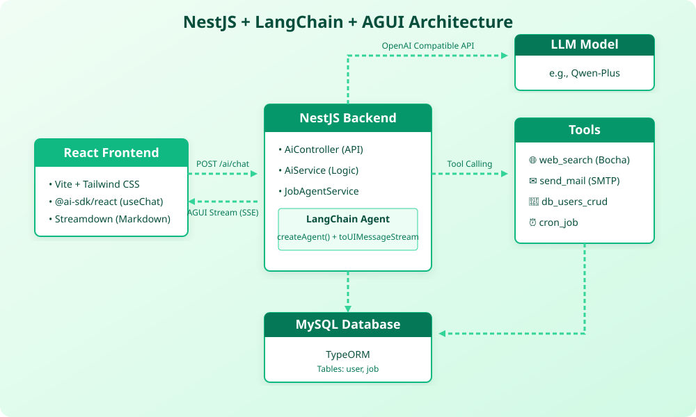

# NestJS + LangChain + AGUI React Demo

This is a full-stack AI Agent demonstration project. It combines a powerful backend agent built with NestJS and LangChain, and a modern, rich-interactive frontend built with React and the Vercel AI SDK (AGUI Protocol).

### Key Features:

- **Backend Agent**: A robust NestJS server orchestrating an LLM via LangChain, capable of executing complex, multi-step tool calls.
- **Rich Frontend**: A modern React application (Vite + Tailwind) that renders AI responses not just as text, but as interactive UI components.
- **AGUI Protocol**: Seamless integration of the Vercel AI SDK Data Stream Protocol to bridge LangChain's execution steps with the frontend's UI state.
- **Real-time Streaming**: Fault-tolerant Markdown streaming (via `streamdown`) and live tool-execution progress indicators.

## 1. Architecture & Technologies

This project demonstrates how to build an AI assistant that doesn't just return plain text, but can actively use tools (like searching the web, sending emails, or querying a database) and render these actions as rich UI components in real-time.



### Tech Stack

**Backend (NestJS)**

- **Framework**: [NestJS](https://nestjs.com/) for scalable server-side architecture.
- **AI/Agent**: [LangChain](https://js.langchain.com/) for orchestrating the LLM and tool calling loop.
- **Protocol**: `@ai-sdk/langchain` adapter to convert LangChain streams into the Vercel AI SDK Data Stream Protocol (AGUI).
- **Database (business)**: TypeORM + **MySQL** for `user` / `job` CRUD and scheduled jobs.
- **Database (RAG, planned)**: **Milvus** for document vectors; sample corpus in [`docs/rag-sample/`](./docs/rag-sample/).
- **Tools**:
  - `web_search`: Real-time internet search via Bocha API.
  - `send_mail`: SMTP email sending via `@nestjs-modules/mailer`.
  - `cron_job`: Background task scheduling via `@nestjs/schedule`.
  - `db_users_crud`: MySQL user CRUD.

**Frontend (React)**

- **Framework**: React + Vite + Tailwind CSS (`agui-frontend` directory).
- **AI Integration**: `@ai-sdk/react` (`useChat`) to handle the SSE data stream and state management.
- **Markdown Rendering**: `streamdown` for smooth, fault-tolerant streaming Markdown rendering (including code blocks and Mermaid charts).
- **Rich Tool UI**: Custom React components to render tool invocations (e.g., a search result card, an email draft card) instead of raw JSON.

---

## 2. Getting Started

### Step 2.1: Configure Environment Variables

Create a `.env` file in the **project root** (or copy [`.env.example`](./.env.example)) and fill in your values:

```env
# --- Required: LLM Configuration ---
OPENAI_BASE_URL=https://dashscope.aliyuncs.com/compatible-mode/v1
OPENAI_API_KEY=your_llm_api_key_here
MODEL_NAME=qwen-plus

# --- Optional: Server Port (Default 3000) ---
PORT=3000

# --- Optional: Web Search Tool (Bocha API) ---
BOCHA_API_KEY=your_bocha_api_key_here

# --- Optional: Send Mail Tool (SMTP) ---
MAIL_HOST=smtp.example.com
MAIL_PORT=465
MAIL_SECURE=true
MAIL_USER=your_email@example.com
MAIL_PASS=your_email_password
MAIL_FROM=your_email@example.com

# --- Optional: MySQL (user / job CRUD via TypeORM) ---
# Defaults in src/app.module.ts: host localhost, database hello, user root

# --- Optional: Milvus (RAG vector store; planned / WIP) ---
# Local Docker: milvus-standalone → localhost:19530
MILVUS_ADDRESS=localhost:19530
MILVUS_COLLECTION=rag_docs
MILVUS_USER=
MILVUS_PASSWORD=
EMBEDDING_MODEL=text-embedding-v3
RAG_DOCS_PATH=docs/rag-sample
RAG_TOP_K=4
```

*Note: MySQL is used for business tables. Milvus is for RAG document vectors. Sample LangChain docs are under `docs/rag-sample/`.*

### Step 2.2: Start the Backend (NestJS)

```bash
npm install
npm run start:dev
```

*Backend: `http://localhost:3000`.*

### Step 2.3: Start the Frontend (AGUI React App)

```bash
cd agui-frontend
npm install
npm run dev
```

*Frontend: `http://localhost:5173`.*

### Step 2.4: Experience the App

Open **[http://localhost:5173](http://localhost:5173)** (AGUI UI) or **[http://localhost:3000/asr.html](http://localhost:3000/asr.html)** (voice chat).

---

## 3. Disclaimer

**Disclaimer**: This project is provided for educational and demonstration purposes only.

- Do not use this code in a production environment without proper security reviews, error handling, and access controls.
- The tools provided (especially `send_mail` and `db_users_crud`) can perform real actions. Please be cautious when exposing these capabilities to an LLM.
- The authors are not responsible for any misuse, data loss, or unexpected charges incurred from third-party APIs (like OpenAI or Bocha) while using this software.
